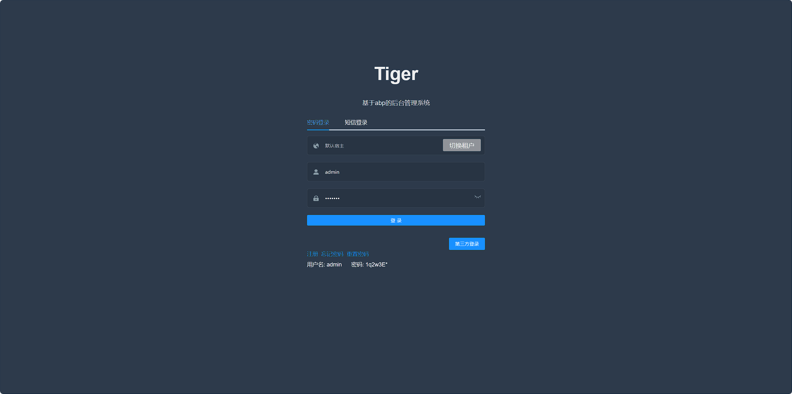
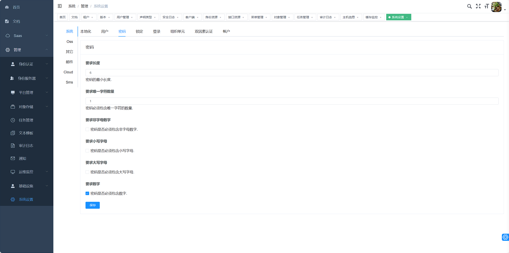
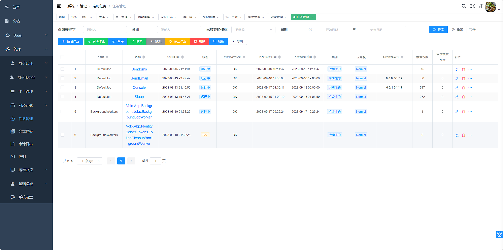
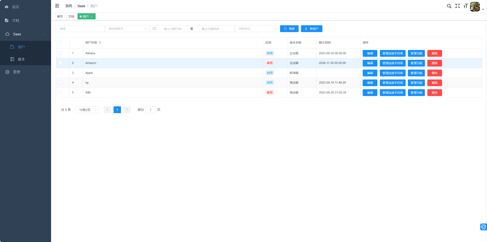
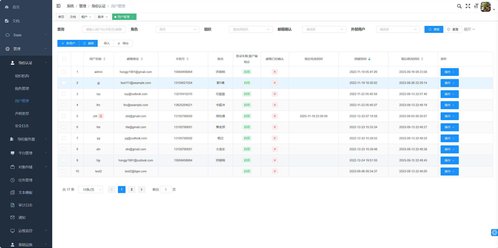
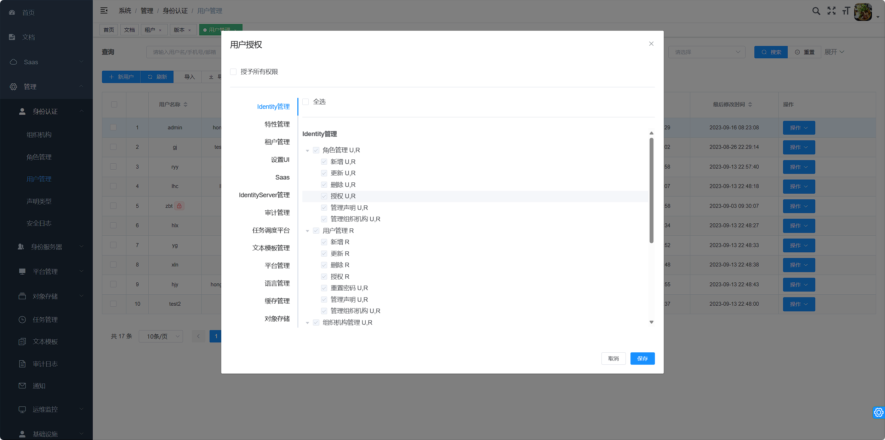
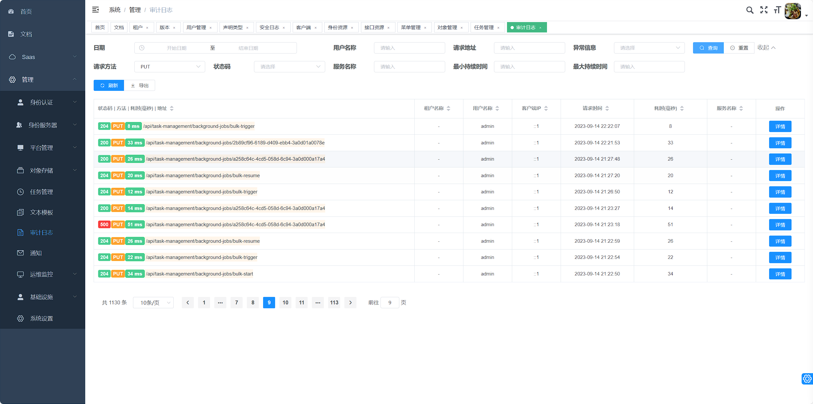
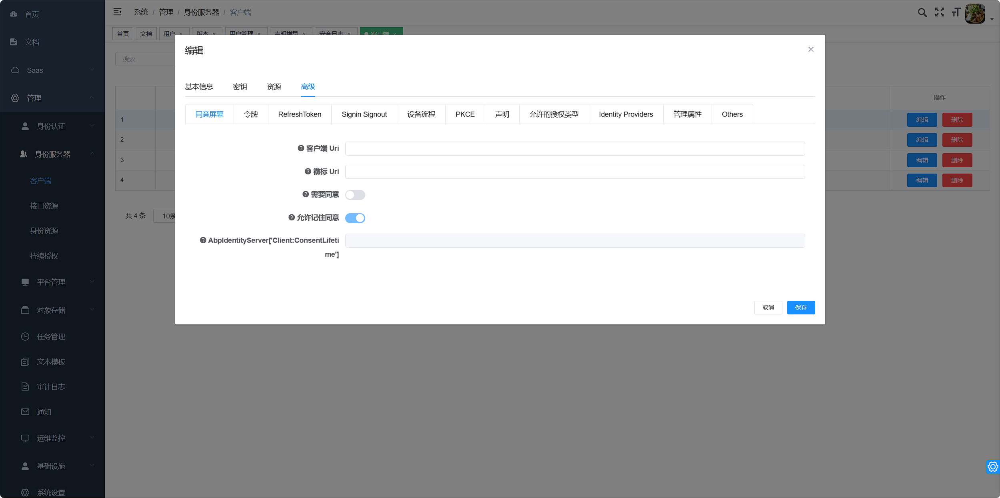
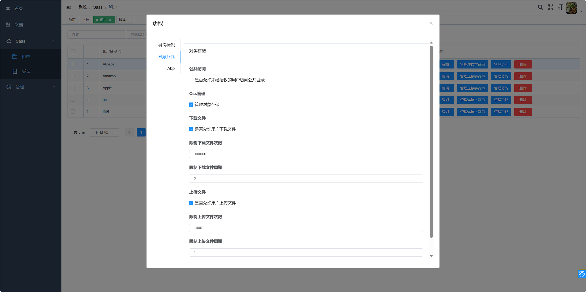
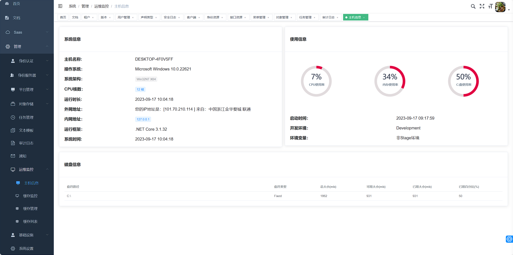

# Tiger
## 基于abp vnext 的后台管理系统

> 基于 vue abp 开发的基础功能管理系统（功能包括权限 id4界面管理 日志 多租户 定时任务管理 等管理功能） 


### 开发环境

| 工具         | 版本号 | 下载                                                         |
| ------------ | ------ | ------------------------------------------------------------ |
| .net core    | 3.1.0  | https://dotnet.microsoft.com/download                        |
| asp.net core | 3.1.10 |                                                              |
| SqlServer    | 2012   | https://www.microsoft.com/en-us/sql-server/sql-server-downloads |
| Redis        | 5.0    | https://redis.io/download                                    |
| RabbitMQ     | 3.7.14 | http://www.rabbitmq.com/download.html                        |
| Sql Server   | 2012   |                                                              |


### 开发步骤


```shell

# 克隆项目
git clone https://github.com/AllenHongjun/tiger.git

# 修改 appsettings.Development.json ConnectionStrings 数据库配置

# 创建数据库 设置 Tiger.HttpApi.Host 为启动项目，打开程序包管理器控制台， 设置 Tiger.EntityFrameworkCore.DbMigrations 为默认项目 执行 Update-Database 

# Ctrl + F5 启动项目 浏览器其访问接口地址:https://localhost:44306/index.html 


# 进入项目目录
cd tiger/vue

# 安装依赖
npm install

# 建议不要直接使用 cnpm 安装依赖，会有各种诡异的 bug。可以通过如下操作解决 npm 下载速度慢的问题
npm install --registry=https://registry.npm.taobao.org

# 启动服务
npm run dev

# 浏览器访问 http://localhost:9528/admin/
```


### 项目截图


























### 开发工具

| 工具          | 说明                | 官网                                                  |
| ------------- | ------------------- | ----------------------------------------------------- |
| Visual Studio | 开发IDE             | https://visualstudio.microsoft.com/                   |
| VS Code       | 文本编辑器          | https://code.visualstudio.com/                        |
| RedisDesktop  | redis客户端连接工具 | https://github.com/qishibo/AnotherRedisDesktopManager |
| Robomongo     | mongo客户端连接工具 | https://robomongo.org/download                        |
| Putty         | Linux远程连接工具   | https://www.putty.org/                                |
| Navicat       | 数据库连接工具      | http://www.formysql.com/xiazai.html                   |
| XMind         | 思维导图设计工具    | https://www.xmind.cn/                                 |
| ScreenToGif   | gif录制工具         | https://www.screentogif.com/                          |
| ProcessOn     | 流程图绘制工具      | https://www.processon.com/                            |
| PicPick       | 图片处理工具        | https://picpick.app/zh/                               |
| Snipaste      | 屏幕截图工具        | https://www.snipaste.com/                             |
| Postman       | API接口调试工具     | https://www.postman.com/                              |
| Typora        | Markdown编辑器      | https://typora.io/                                    |
| ABP CLI       | 代码生成工具        | https://github.com/EasyAbp/AbpHelper.GUI              |
|               |                     |                                                       |
|               |                     |                                                       |
|               |                     |                                                       |


### 主要技术

> 采用现阶主流技术实现

#### 后端

| 技术                                                         | 版本    | 说明                        | 站点                                                         |
| ------------------------------------------------------------ | ------- | --------------------------- | ------------------------------------------------------------ |
| [Asp.Net core](docs.microsoft.com/en-us/aspnet/core/?view=aspnetcore-5.0) | 3.1.10  | MVC框架                     |                                                              |
| [IDentityServer4](github.com/IdentityServer/IdentityServer4) |         | 认证和授权框架              |                                                              |
| [EntityFreamwork core](https://docs.microsoft.com/en-us/ef/core/) | 3.0     | ORM框架                     |                                                              |
| [ABP Freamwork](https://docs.abp.io/en/abp/3.2)              | 3.2.1   | 基于Asp.Net coreweb应用框架 | [live-demo](https://commercial-demo.abp.io/identity/organization-units) |
| [AutoFac](https://autofac.org/)                              |         | 依赖注入容器                |                                                              |
| [Swagger-UI](github.com/domaindrivendev/Swashbuckle.AspNetCore) | 5.0.0   | 自动生成API文档             |                                                              |
| [Elasticsearch](https://www.elastic.co/)                     | 7.6.2   | 分词搜索引擎                |                                                              |
| [RabbitMq](https://www.rabbitmq.com/)                        | 3.7.14  | 消息队列                    |                                                              |
| [Redis](https://github.com/redis/redis)                      | 5.0     | 分布式缓存                  |                                                              |
| [MongoDb](https://www.mongodb.com/)                          | 4.2.5   | NoSql数据库                 |                                                              |
| [Docker](https://www.docker.com/)                            | 18.09.0 | 应用容器引擎 部署工具       |                                                              |
| [OSS-七牛](https://developer.qiniu.com/kodo/1277/product-introduction) | 2.5.0   | 对象存储                    |                                                              |
| JWT                                                          | 0.9.0   | JWT登录支持                 |                                                              |
|                                                              |         |                             |                                                              |
|                                                              |         |                             |                                                              |


#### 前端

| 技术                                                         | 说明             | 官网                                                         |      |
| :----------------------------------------------------------- | ---------------- | ------------------------------------------------------------ | ---- |
| [vue](https://cn.vuejs.org/index.html)                       | 前端框架         | https://vuejs.org/                                           |      |
| [vue-router](https://next.router.vuejs.org/)                 | 路由框架         | https://router.vuejs.org/                                    |      |
| [vuex](https://vuex.vuejs.org/zh/guide/)                     | 全局状态管理框架 | https://vuex.vuejs.org/                                      |      |
| Element                                                      | 前端UI框架       | [https://element.eleme.io](https://element.eleme.io/)        |      |
| [axios](https://axios-http.com/zh/)                          | 前端HTTP框架     | https://github.com/axios/axios                               |      |
| [echarts 4.1.3](https://echarts.apache.org/v4/examples/zh/editor.html?c=pie-legend) | 图表框架         | https://v-charts.js.org/                                     |      |
| Js-cookie                                                    | cookie管理工具   | https://github.com/js-cookie/js-cookie                       |      |
| nprogress                                                    | 进度条控件       | https://github.com/rstacruz/nprogress                        |      |
| [vue-cli](https://cli.vuejs.org/zh/)                         | 脚手架搭建工具   |                                                              |      |
| [mockjs](http://mockjs.com/)                                 | 接口模拟         |                                                              |      |
| [vue-admin-template 4.4.0](https://github.com/PanJiaChen/vue-admin-template/blob/master/README-zh.md) | 前端界面脚手架   | [演示地址](https://panjiachen.github.io/vue-admin-template/#/login?redirect=%2Fdashboard) |      |
| [vue-elment-admin 4.2.1](https://panjiachen.github.io/vue-element-admin-site/zh/) | 界面框架         | [演示地址](https://panjiachen.github.io/vue-element-admin/#/dashboard) |      |
| [elemnt-ui 2.13.2](https://element.eleme.cn/2.13/#/zh-CN)    | 前端界面组件     | [https://element.eleme.cn/2.13/#/zh-CN/component/installation](https://element.eleme.cn/2.13/#/zh-CN/component/installation) |      |
|                                                              |                  |                                                              |      |


